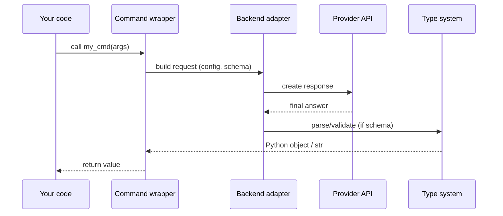
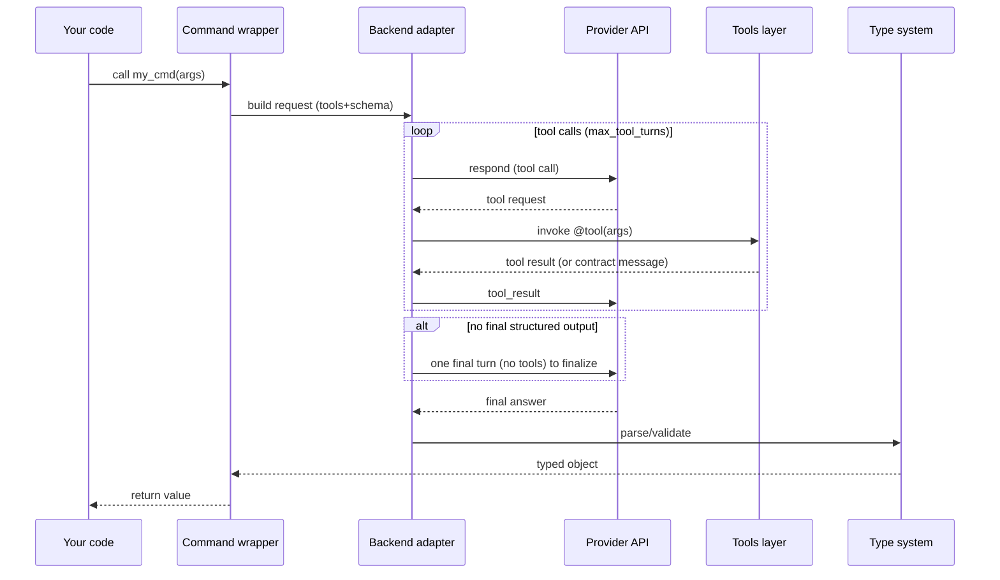

# Command Lifecycle

Understand how a command runs end‑to‑end (~4 minutes).

---

## Sequence (no tools)

## Sequence (with tools, strict output)

## Notes

- Finalization: for providers that require it, Alloy may issue one final turn (without tools) to obtain a structured answer when tools were used and no final was returned.
- Limits: the tool loop is capped by `max_tool_turns` (default 10) to avoid runaway behavior.
- Errors: configuration errors surface immediately; parse failures raise `CommandError` with expected type/context.
