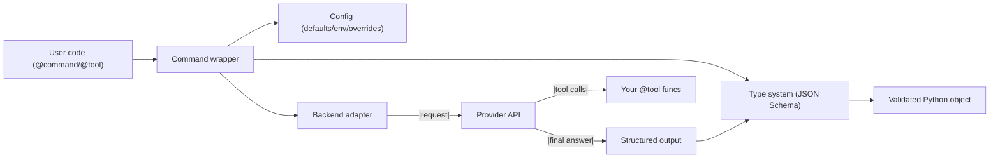

# Architecture Overview

High‑level map of the command lifecycle, provider abstraction, and type system (~3 minutes).

---

## System Map

## Key Components

- Command lifecycle: prompt → (tool loop) → finalization → typed parse → result.
- Provider abstraction: thin adapters translate a uniform request into provider‑specific APIs.
- Type system: Python annotations → JSON Schema → provider structured outputs → Python objects.
- Errors: clear separation of configuration errors vs. model/parse errors.
- Streaming: text‑only today; preview for sequence‑of‑objects.

## Code References

- Backends: [openai.py](https://github.com/lydakis/alloy/blob/main/src/alloy/models/openai.py), [anthropic.py](https://github.com/lydakis/alloy/blob/main/src/alloy/models/anthropic.py), [gemini.py](https://github.com/lydakis/alloy/blob/main/src/alloy/models/gemini.py), [ollama.py](https://github.com/lydakis/alloy/blob/main/src/alloy/models/ollama.py)
- Type system: [types.py](https://github.com/lydakis/alloy/blob/main/src/alloy/types.py) (schema), [command.py](https://github.com/lydakis/alloy/blob/main/src/alloy/command.py) (parsing)
- Contracts: [tool.py](https://github.com/lydakis/alloy/blob/main/src/alloy/tool.py) (require/ensure)

See detailed pages for diagrams and deeper explanations.
